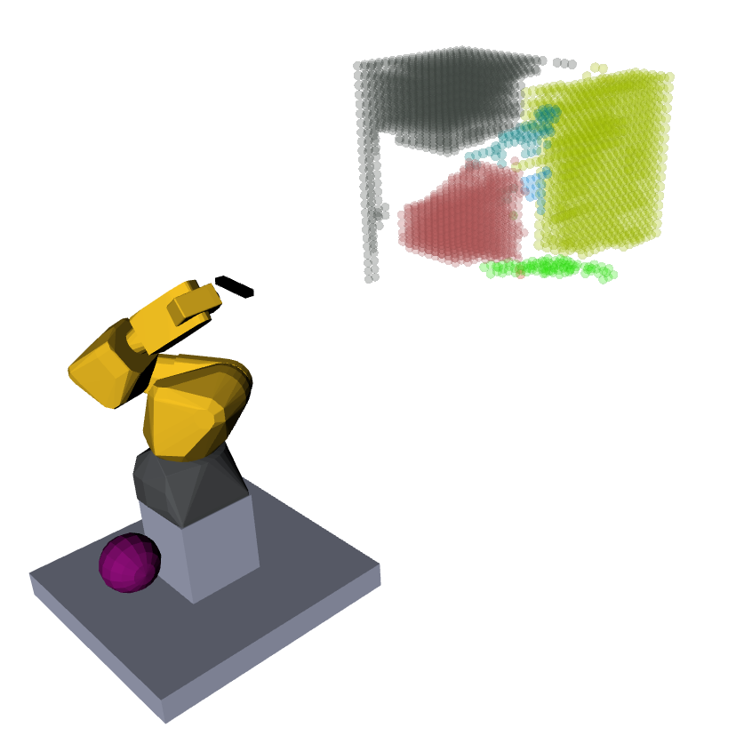
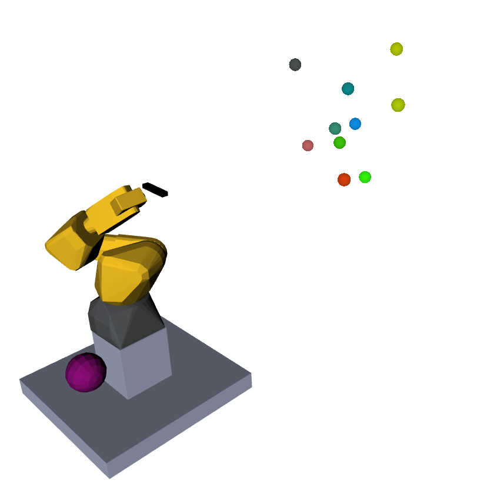

# SmObEx: Smart Object Exploration

## SmObEx Explorer Action Package

Package containing:

    - action implementation of the exploration methods

## Unknown Space Finding

Package: [Octomap Tools](https://github.com/miguelriemoliveira/octomap_tools)

Orange: Unknown Voxels

## Clusters

After knowing which voxels are unknown, we can cluster them (by connection)

and then find the centroid of those clusters

## Pose Evaluation

Evaluated pose:

Green: Free Voxels

Red: Occupied Voxels

Orange: Unknown Voxels

Blue: Voxels expected to be known with this pose

Red Wireframe: camera's frustum

Gray Lines: Rays used in raycasting